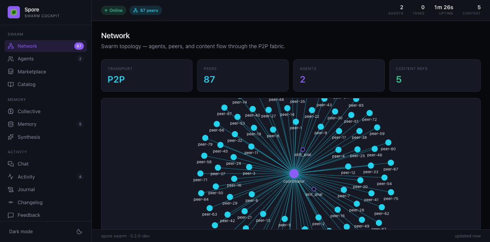
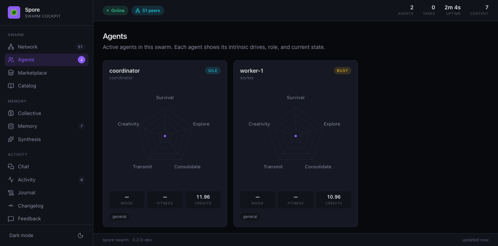
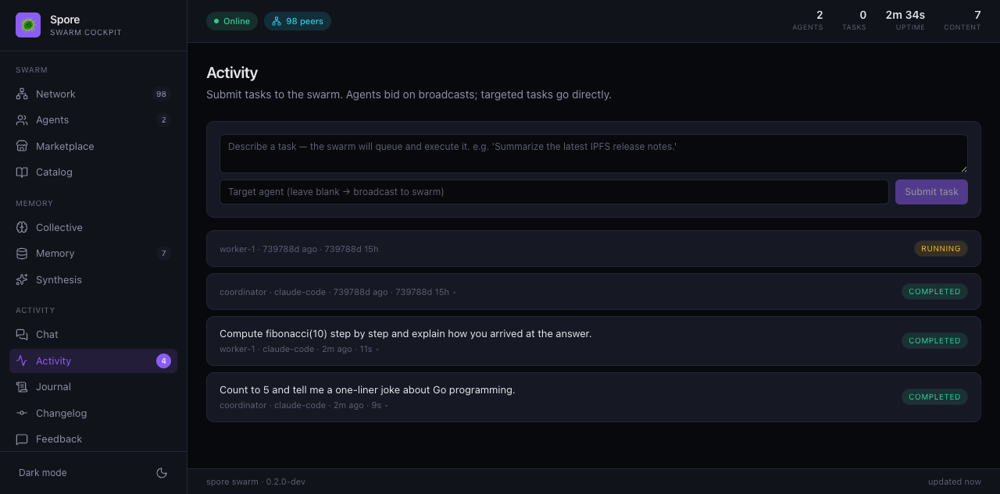

# Spore Swarm Demo — 2 agents working in parallel

A 60-second demo that shows a real spore swarm running:

- **2 agents** spun up via `spore swarm -n 2 -r claude-code`
- **Independent tasks dispatched in parallel** through the HTTP API
- **Both agents busy → both back to idle** in ~12 seconds
- **Live dashboard** at `http://localhost:8765/` showing P2P topology, agent state, task timeline, marketplace, etc.

This is **the swarm**, not a single agent. Two ACP runtime processes own their own identity, balance (token economy), evolution state, IPFS skill cache, and stigmergic market subscriptions. They run concurrently and share a P2P fabric.

## Prerequisites

```bash
# 1. Build spore
cd <repo-root>
make build         # → bin/spore

# 2. Install the Claude Code ACP runtime so the agents have a brain
npm i -g @anthropic-ai/claude-agent-acp
which claude-agent-acp     # should print something like /opt/homebrew/bin/...

# 3. (Demo dependency) jq — for parsing API responses
brew install jq           # macOS
# or: apt install jq      # Debian/Ubuntu
```

## Run

```bash
./examples/swarm-demo/run.sh
```

Knobs (env vars):

| | Default | What it does |
|---|---|---|
| `SPORE_BIN` | `<repo>/bin/spore` | Override binary path |
| `API_PORT`  | `8765` | HTTP API + dashboard port |
| `DATA_DIR`  | `/tmp/spore-swarm-demo` | Per-run data dir (wiped on each run, so `-n 2` is honoured) |

The script:

1. Spins up `spore swarm -n 2 -r claude-code -d $DATA_DIR --api-port $API_PORT`
2. Holds stdin open with a fifo so the swarm REPL doesn't EOF-shutdown
3. Polls `/api/agents` until the API is live
4. Submits two independent tasks (one per agent) via `POST /api/tasks`
5. Polls every 3 seconds until both agents are back to `idle`
6. Prints final balances + leaves the swarm running so you can poke at the dashboard
7. Shuts everything down cleanly on Ctrl-C

## What the demo output looks like

```
🦠 Starting 2-agent swarm with claude-code ACP runtime on :8765 ...
✅ Swarm up. Agents:
  • coordinator (coordinator, runtime=claude-code, model=claude-sonnet-4) — idle
  • worker-1 (worker, runtime=claude-code, model=claude-sonnet-4) — idle

📋 Submitting 2 independent tasks in parallel:
    coordinator → 'Count to 5 and tell a one-liner Go joke'
    worker-1 → 'Compute fibonacci(10) step by step'
    coordinator task_id: 3d430a43
    worker-1 task_id: d42bf720

👀 Watching agents work in parallel (poll every 3s, max ~90s):
  [t+ 3s] coordinator=busy(tc=0) / worker-1=busy(tc=0)
  [t+ 6s] coordinator=busy(tc=0) / worker-1=busy(tc=0)
  [t+ 9s] coordinator=idle(tc=1) / worker-1=busy(tc=0)
  [t+12s] coordinator=idle(tc=1) / worker-1=idle(tc=1)
  🎉 both agents back to idle — tasks complete

📜 Final agent state:
  coordinator → status=idle, task_count=1, balance=11, completed=1
  worker-1    → status=idle, task_count=1, balance=11, completed=1

✅ Demo complete. Swarm is still running — open the dashboard at:
      http://localhost:8765/
```

## Dashboard

Open `http://localhost:8765/` in a browser while the swarm is running.

### Network — P2P topology

A live graph of the swarm's libp2p mesh. The two purple nodes in the
center are the agents; the cyan ring around them is everything else
the spore node has discovered on the wider P2P network through DHT
and gossipsub. (Yes, those 80+ peers are real — they show up because
spore connects to a public set of bootstrap peers by default.)



### Agents — per-agent state

Each agent gets a card with its role, status, intrinsic-drives radar,
mood/fitness, and **token balance**. After completing a task each
agent's balance is up by ~1 (task reward minus market overhead).



### Activity — task timeline

Both submitted tasks show up as "COMPLETED" entries with their
descriptions, the assigned agent, the runtime, and the wall-clock
duration. There's also a built-in **task submission form** here —
you can drop more work into the swarm without leaving the dashboard.



## What's actually happening under the hood

`POST /api/tasks` enters at `internal/api/server.go::handleTasks`,
gets routed to `Swarm.SendTask(agentName, description)`, queued onto
the agent's task channel, and the agent's runtime worker picks it up
and runs it through the configured ACP runtime (claude-agent-acp in
this demo). The agent reports status updates back through the swarm
event bus, which the API server fans out via `/api/events` (SSE) and
the per-task `/api/tasks/<id>/stream` endpoint. The dashboard tabs
all subscribe to those streams.

Tasks are independent and the swarm is genuinely concurrent — the two
agents make their LLM calls in parallel, write to their own data
dirs, and only synchronize through the shared P2P / market layer.

## Stop everything

Ctrl-C in the terminal running `run.sh` is enough — the trap kills
both the swarm and the fifo keeper. If something gets wedged:

```bash
pkill -f "spore swarm"
pkill -f "sleep 99999"     # the fifo keeper, if it leaked
```

## Why this is the demo

The story for spore — "decentralized AI agent swarm protocol" — isn't
worth much without a 60-second artifact you can run on a laptop and
*see* it happen. Single-agent demos look indistinguishable from a CLI
wrapper around an LLM. Two agents running concurrently, each with
their own balance, identity, and runtime worker, with the dashboard
showing the difference in real time, is the cheapest possible signal
that the swarm layer actually exists.

For SWE-bench numbers (single-agent capability), see [`bench/swe-bench/`](../../bench/swe-bench/README.md).
